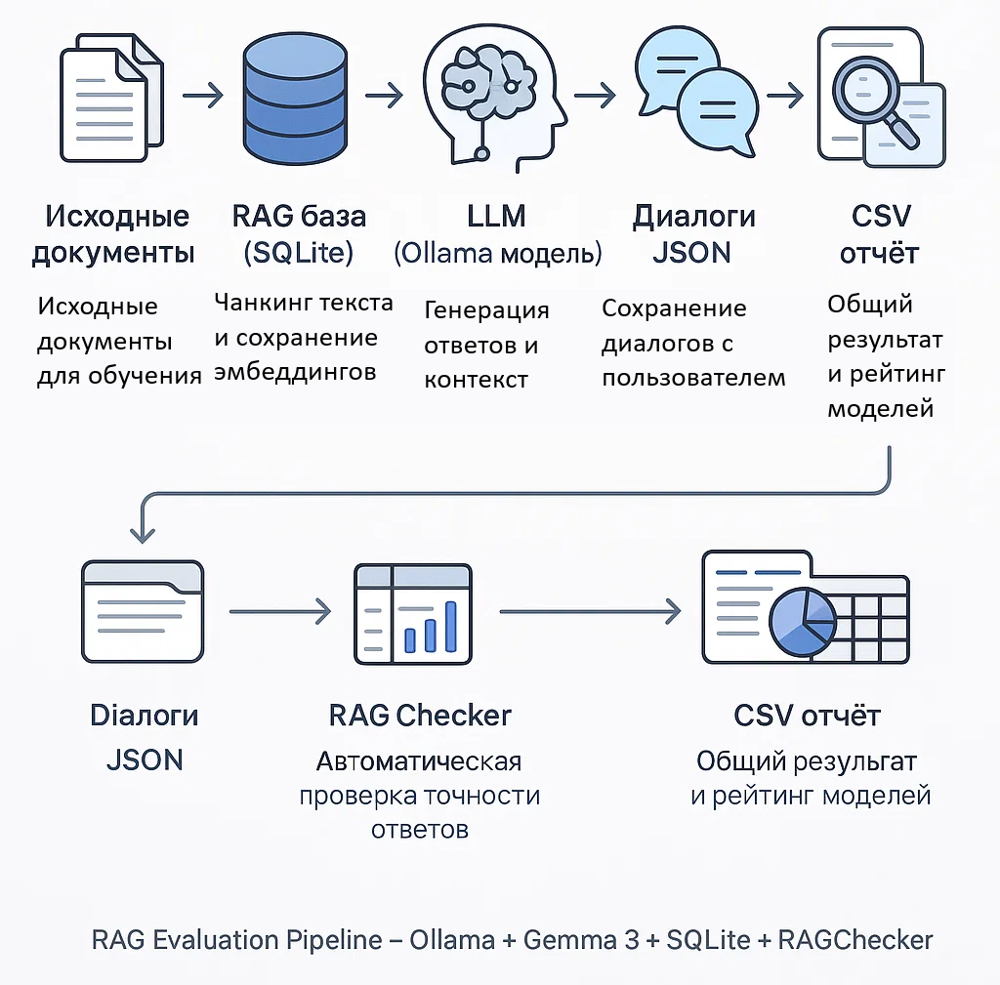

# AI-Агент для образования

## 📌 Описание проекта
Проект представляет собой прототип образовательного AI-ассистента на базе больших языковых моделей (LLM), способного вести обучающий диалог со студентом строго на основе предоставленных лекционных материалов. Ассистент задаёт уточняющие вопросы, отвечает на вопросы по теории, предлагает задания и проверяет понимание студента. Для повышения точности используется RAG (Retrieval Augmented Generation) — поиск релевантных фрагментов лекции перед генерацией ответа.

---

## 🎯 Цель
Создать AI-агента, который может вести студента по материалу лекций, следуя фиксированному сценарию, диалоговым паттернам и опираясь только на загруженные документы. А также провести сравнение моделей и оценку качества диалогов на разных типах лекционного материала.

---

## ✅ Возможности
- Ответы на вопросы по лекциям
- Контроль диалога с уточняющими вопросами
- Предложение практических задач
- Объяснение правильных ответов
- RAG-поиск информации в документах
- Автоматическая оценка качества ответов моделей через [RAGChecker](https://github.com/amazon-science/RAGChecker)
- Тестирование разных LLM через Ollama
- Сравнение результатов на разных лекциях

---

## 🗂 Структура репозитория
```
.
├── 📊 analytics/                       # Аналитика и сравнение моделей
│   ├── README.md                       # Главная документация аналитики
│   ├── docs/                           # Детальная документация
│   │   ├── RAGChecker.md               # Описание метрик RAGChecker
│   │   ├── integration-and-admin.md    # Описание интеграции и администрирования
│   │   ├── Comparison.md               # Сравнение версий промптов
│   │   ├── StandardFormat.md           # Спецификация формата данных
│   │   └── Summary.md                  # Краткая сводка результатов
│   │
│   ├── 📈 Отчеты и результаты
│   │   └── standard_format_output/          # Данные в стандартном формате
│   │
│   ├── 🐍 Скрипты анализа
│   │   ├── compare_lectures.py              # Сравнение всех лекций (version_* + 2-file)
│   │   └── convert_to_standard_format.py    # Конвертация в стандартный формат
│   │
│   ├── 📁 Данные версий (Classifiers + Инструменты НС)
│   │   ├──  version_1/                      # Version 1 (английские промпты)
│   │   │   ├── RAGChecker_outputs/          # Метрики RAGChecker
│   │   │   ├── model_outputs/               # Диалоги моделей
│   │   │   ├── checking_inputs.json         # Вопросы по лекциям
│   │   │   └── system_prompts.json          # Системные промпты
│   │   ├── version_2/                       # Version 2 (русские промпты v1)
│   │   └── version_3/                       # Version 3 (русские промпты v2) ⭐ ЛУЧШАЯ
│   │
│   ├── 📝 2-file/                           # Тестирование на лекции RNN
│   │   ├── v1/                              # Version 1 (английские промпты)
│   │   │   ├── RAGChecker_OUTPUTS/
│   │   │   ├── model_outputs/
│   │   │   ├── checking_inputs.json
│   │   │   └── system_prompts.json
│   │   ├── V2/                              # Version 2 (русские промпты v1)
│   │   └── v3/                              # Version 3 (русские промпты v2)
│   │
│   └── 📜 Документация PDF
│       ├── метрики-продуктовый-трек.pdf
│       └── описание_метрик.pdf
│
├── 📚 documents/                       # Документы для RAG (лекции)
│   ├── 1_Классификаторы_KNN_и_наивный_байес.tex
│   ├── 3. Инструменты обучения НС.tex
│   └── 5._Рекуррентные_НС.tex
│
├── 🔧 Основные скрипты
│   ├── evaluate_with_ragchecker.py     # Скрипт оценки диалогов
│   ├── llm_processor.py                # RAG-процессинг и база эмбеддингов
│   ├── checking_inputs.json            # Эталонные вопросы-ответы
│   └── system_prompts.json             # Системные промпты
│
├── 📁 Исторические версии (архив)
│   ├── first version/                  # Диалоги первой версии промптов
│   ├── second version/                 # Диалоги второй версии промптов
│   └── secon version + rag/            # Вторая версия с RAG-механикой
│
├── 📊 Сводные отчеты (в корне проекта)
│   ├── lecture_comparison_analysis.xlsx  # 🆕 Сводный отчет по всем лекциям
│   └── all_data.csv   # 🆕 Данные для аналитики (CSV)
│
├── 🎨 frontend/                       # Фронтенд для использования модели
│   └── (в разработке)
│
├── 📈 visualization/                  # Визуализация данных (React)
│   ├── src/                           # Исходный код React приложения
│   │   ├── components/                # Компоненты (Filters, Charts, Comparison, etc.)
│   │   ├── App.tsx                    # Главный компонент
│   │   └── types.ts                   # TypeScript типы
│   ├── public/                        # Публичные файлы
│   │   └── all_data.csv               # Данные для визуализации
│   ├── package.json                   # Зависимости npm
│   └── README.md                       # Документация визуализации
│
├── pipeline.png                        # Схема архитектуры
├── requirements.txt                    # Зависимости Python
├── LICENSE
└── README.md
```
---

## 🔧 Требования

### Установите зависимости:
```bash
pip install -r requirements.txt
```

Нужно локально:
- **Python 3.10+**
- **Ollama** (с установленными моделями)
- sentence-transformers
- sklearn
- torch
- ragchecker
- pandas
- openpyxl
- requests
- sqlite

---

## 🚀 Запуск

### 1. Подготовка базы знаний
Положите лекции (.txt или .tex) в папку `documents/`. Базы эмбеддингов создаются автоматически при запуске.

### 2. Запуск оценки моделей
```bash
python evaluate_with_ragchecker.py --input-file "documents/1_Классификаторы_KNN_и_наивный_байес.tex" --output-dir "analytics/version_3"
```

### 3. Анализ результатов

**🆕 Сравнение всех лекций (рекомендуется):**
```bash
cd analytics
python3 compare_lectures.py
```

Создаст файлы в корне проекта:
- **lecture_comparison_analysis.xlsx** - полный отчет с визуализацией
- **lecture_comparison_analysis.csv** - все данные для дальнейшей аналитики

**Содержание отчета:**
- Сравнение метрик на всех лекциях:
  - `1_Классификаторы_KNN_и_наивный_байес.tex` (analytics/version_*)
  - `3. Инструменты обучения НС.tex` (analytics/version_*)
  - `5._Рекуррентные_НС.tex` (analytics/2-file/)
- Анализ по моделям и версиям промптов
- Матрицы F1 для всех комбинаций
- Лучшие конфигурации для каждой лекции

**Анализ всех данных:**
```bash
cd analytics
python3 compare_lectures.py
```

Этот скрипт объединяет данные из всех версий (version_* и 2-file/) и создает единый отчет.

**Конвертация в стандартный формат:**
```bash
cd analytics
python3 convert_to_standard_format.py
```

Создаст в `analytics/standard_format_output/`:
- Объединенные папки диалогов: `dialogs_v1_english`, `dialogs_v2_russian`, `dialogs_v3_russian_v2`
- Overall reports для каждой версии (Excel + CSV)
- Объединенный overall_report_combined.xlsx со всеми данными
- System prompts в форматах xlsx/csv/json

**Визуализация данных:**
```bash
cd visualization
npm install
npm run dev
```

Откроет интерактивное веб-приложение на `http://localhost:3333` с:
- Фильтрацией по версиям, моделям, промптам, лекциям
- Интерактивными графиками (Recharts)
- Сравнением метрик между версиями и моделями
- Статистикой (средние, минимумы, максимумы)
- Таблицей данных с сортировкой и пагинацией

📖 Подробнее: [visualization/README.md](visualization/README.md)

---

### 4. Результаты

После выполнения анализа в проекте появятся:

**В корне проекта:**
- `lecture_comparison_analysis.xlsx` — сводный отчет по всем лекциям (Excel)
- `lecture_comparison_analysis.csv` — все данные для аналитики (CSV, 111 KB, 810 записей)

**В analytics/:**
- `standard_format_output/` — данные в стандартном формате:
  - `overall_report_combined.xlsx` — 12,240 записей (761 KB)
  - `overall_report_v1_english.xlsx` — 4,125 записей
  - `overall_report_v2_russian.xlsx` — 4,050 записей
  - `overall_report_v3_russian_v2.xlsx` — 4,065 записей
  - `dialogs_v1_english/` — 2,700 JSON файлов
  - `dialogs_v2_russian/` — 2,250 JSON файлов
  - `dialogs_v3_russian_v2/` — 1,500 JSON файлов

**Подробные метрики:**
  - Ссылка на фронт с подробным анализом метрик и фильтрами: http://167.71.1.157:8080
---

## 🧠 Архитектура


### RAG-механика
Реализована в `llm_processor.py`:
1. Чанкирование лекций
2. Векторные эмбеддинги (sentence-transformers)
3. Поиск ближайших chunk'ов (cosine similarity)
4. Передача контекста в LLM

### Пример запроса
```python
from llm_processor import process_query
answer = process_query(
    "Что такое метод k-NN?",
    "1_Классификаторы_KNN_и_наивный_байес",
    "gemma3:4b"
)
print(answer)
```

---

## 📊 Протестированные модели

| Модель | Размер | F1 (v3), % | Рейтинг |
|--------|--------|-----------|---------|
| gemma3:4b | 4.3B | 46.66 | ⭐⭐⭐⭐⭐ |
| mistral:7b | 7B | ~35-40 | ⭐⭐⭐⭐ |
| phi4-mini:3.8b | 3.8B | ~30-35 | ⭐⭐⭐ |
| llama3.2:1b | 1B | ~25-30 | ⭐⭐ |
| deepseek-r1:1.5b | 1.5B | ~25-30 | ⭐⭐ |
| granite3.2:2b | 2B | ~25-30 | ⭐⭐ |

**Лучшая конфигурация:**
- **Модель:** gemma3:4b (4.3B параметров)
- **Промпт:** prompt11
- **Версия:** v3 (русские промпты, версия 2.0)
- **F1 Score:** 46.66%

---

## 📈 Метрики RAGChecker

Все эксперименты оцениваются с помощью [RAGChecker](https://github.com/amazon-science/RAGChecker):

**Overall Metrics:**
- **F1** - главная метрика качества, баланс точности и полноты (>60% - отлично, 40-60% - хорошо)
- **Precision** - доля правильных утверждений в ответе
- **Recall** - доля эталонных утверждений, покрытых моделью

**Retriever Metrics:**
- **Claim Recall** - качество поиска релевантных чанков
- **Context Precision** - доля релевантных чанков среди извлеченных

**Generator Metrics:**
- **Context Utilization** - эффективность использования контекста
- **Hallucination** - доля "изобретенных" фактов (<10% - отлично, >50% - неприемлемо)
- **Faithfulness** - точность следования контексту (>80% - отлично)
- **Noise Sensitivity** - чувствительность к шуму в контексте

📖 Подробнее: [analytics/docs/RAGChecker.md](analytics/docs/RAGChecker.md)

---

## 📊 Структура данных экспериментов

### Overall Reports
Содержат все записи экспериментов:

| Поле | Описание |
|------|----------|
| `model_name` | Название LLM (gemma3, mistral, etc.) |
| `model_parameters` | Размер модели (1.0B, 4.3B, 7.0B) |
| `lecture_title` | Название файла лекции |
| `lecture_topic` | Тема/вопрос |
| `system_prompt_id` | ID промпта (prompt1-prompt15) |
| `dialog_id` | ID диалога (dialog0001-dialog2700) |
| `f1`, `precision`, `recall` | Overall метрики |
| `claim_recall`, `context_precision` | Retriever метрики |
| `context_utilization`, `hallucination`, `faithfulness` | Generator метрики |

### Файлы диалогов
Каждый диалог сохранен в JSON формате:
```json
{
  "metadata": {
    "dialog_id": "dialog0001",
    "model_name": "gemma3",
    "model_parameters": "4.3B",
    "lecture_title": "1_Классификаторы_KNN_и_наивный_байес.tex",
    "f1": 46.66,
    "precision": 45.2,
    "recall": 48.1
  },
  "turns": [
    {
      "turn_number": 1,
      "role": "user",
      "content": "Что такое метод k-NN?"
    },
    {
      "turn_number": 2,
      "role": "assistant",
      "model_response": "Метод k ближайших соседей..."
    }
  ]
}
```

---

## ✅ Используемые технологии
- **Python 3.10+**
- **Ollama** — локальный запуск LLM
- **Sentence Transformers** — векторные эмбеддинги
- **RAGChecker** — оценка качества RAG-систем
- **Cosine Similarity** — поиск релевантных чанков
- **SQLite** — хранение эмбеддингов
- **Pandas, OpenpyXL** — обработка и визуализация данных

---

## 📚 Документация

- **Главная документация аналитики:** [analytics/README.md](analytics/README.md)
- **Метрики RAGChecker:** [analytics/docs/RAGChecker.md](analytics/docs/RAGChecker.md)
- **Сравнение версий:** [analytics/docs/Comparison.md](analytics/docs/Comparison.md)
- **Стандартный формат данных:** [analytics/docs/StandardFormat.md](analytics/docs/StandardFormat.md)
- **Краткая сводка:** [analytics/docs/Summary.md](analytics/docs/Summary.md)
- **Интеграция и администрирование** [analytics/docs/integration-and-admin.md](analytics/docs/integration-and-admin.md)
---

## 🏁 Команда и роли
- **Шабуров Антон Андреевич** [@Senri1](https://github.com/Senri1) — Инженер-разработчик (Architecture, RAG, LLM Integration, Evaluation Pipeline)
- **Терешкин Дмитрий Александрович** [@Otrix_ai](https://github.com/Otrix_ai) — Инженер-аналитик (Data Preparation, Prompt Engineering, Experiment Design, Analysis)

---

## 📜 Лицензия
Проект распространяется по лицензии MIT (см. файл [LICENSE](LICENSE)).

---

## 📬 Контакты
Если у вас есть вопросы — обращайтесь через Issues в репозитории.

---
